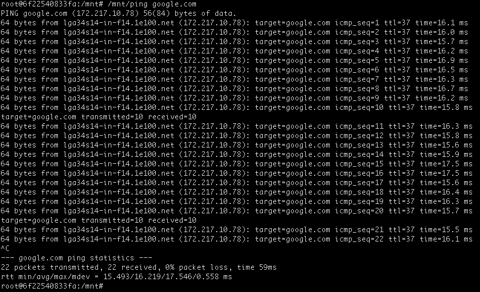

# This is not the iputils you are looking for!

This repo is forked from the official repo, but contains a hacked version of ping 
that I tweaked for use in my [Splunk Network Health Check](https://github.com/dmuth/splunk-network-health-check).

## Development Instructions

```
docker build -t iputils . && docker run -it -v $(pwd):/mnt iputils
# cd /mnt/
# make && /mnt/ping google.com
```

## Sample Output



Note the following additions:

- The target hostname/IP is included in the output.
- Every 10 pings transmitted, stats for the last 10 pings are written.
- ...this also means that latency followed by recovery could cause received values of higher than 10. Please plan for this!


# Iputils

[](https://travis-ci.org/iputils/iputils)
[](https://scan.coverity.com/projects/1944)

The iputils package is set of small useful utilities for Linux networking.

These tools are included in iputils
- arping
- clockdiff
- ipg
- ping
- rarpd
- rdisc
- tftpd
- tracepath
- traceroute6

If you still use [old version](http://www.skbuff.net/iputils/), please consider moving forward to new releases placed here.

This version also fully supports glibc, uClibc and musl-libc.

<!-- vim: set tw=80: -->

